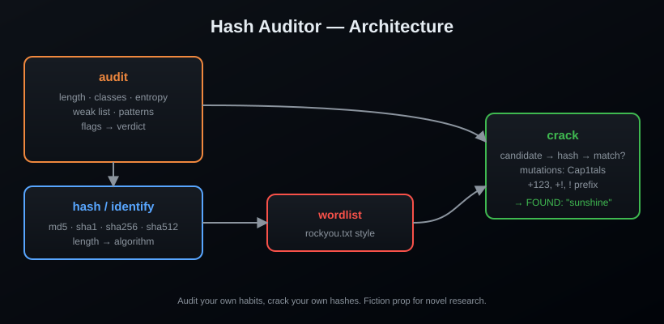

<div align="center">

# 🔐 Hash Auditor


**Audit your passwords. Hash them. Identify hashes. Crack your own.**

[](https://www.python.org/)
[](LICENSE)
[](https://pypi.org/project/hash-auditor/)
[]()

> *"The password is the lock. Most people use a paper clip."*

</div>

---

## What is it?

A pocket knife for password hygiene: measure how weak your passwords really
are, compute hashes in common formats, identify a hash's algorithm from its
length, and brute-force **your own** hashes with a wordlist and common
mutations. Every cracked hash in your lab is a story your novel's hacker
would tell with a smirk.

## Features

- 📏 `check` — length, character classes, entropy, weak-list, patterns, verdict
- 🔑 `hash` — md5, sha1, sha256, sha512
- 🕵️ `identify` — guess the algorithm from hash length
- 💥 `crack` — wordlist attack with mutations (`Cap1tals`, `+123`, `+!`, ...)
- 📦 Zero dependencies

## Install

```bash
pip install hash-auditor
```

From source:

```bash
git clone https://github.com/AnonymoDGH/hash-auditor
cd hash-auditor
pip install -e .
```

## Quickstart

```bash
# 1. Audit a password
hashaudit check "password123"
# [*] length:           11
# [*] character classes:2
# [*] entropy (approx): 51.5 bits
# [-] in the known-weak list
# [-] verdict: weak

# 2. Hash something
hashaudit hash --algo md5 "sunshine"
# 3e1d2e2e1e7c7a1c5e2d8f6f1c2e3d4a  (fake value — compute your own)

# 3. Identify a hash by its length
hashaudit identify 5d41402abc4b2a76b9719d911017c592
# md5

# 4. Crack your own hash with a wordlist
hashaudit crack --hash 5d41402abc4b2a76b9719d911017c592 --wordlist rockyou.txt
# [+] FOUND: 'hello'
```

## CLI reference

| Command | What it does |
|---|---|
| `hashaudit check <password>` | Full audit report |
| `hashaudit hash <password> --algo <a>` | Compute a hash |
| `hashaudit identify <hex>` | Guess algorithm from length |
| `hashaudit crack --hash <hex> --wordlist <f> [--algo <a>]` | Brute-force with mutations |
| `hashaudit crack --nomutate` | Skip mutation candidates |

## How it works



## Tests

```bash
pip install pytest
pytest
```

## License

[MIT](LICENSE) — audit your own habits, crack your own hashes, and keep the
villain's password cracking on the page.
